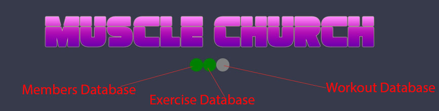
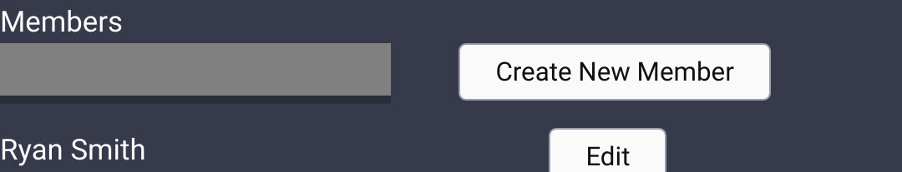

# Muscle Church (under construction)

[Check out the live application HERE](https://muscle-church.com/)

A React application used to track, log, and display workouts.

- The Concept is lifting weights under constant tension for 90-120 seconds with no rest periods to bring your muscles to a natural failure state to promote core muscle growth.

- This application was primarily designed for mobile use. To function as a stopwatch and logger while we work out.

Tech used: <b>Javascript, Typescript, React, Redux, Redux-Saga, Graphql, Reselect, React-Router, Styled Components, AWS Amplify, DynmoDB, and APPSync</b>

## Architecture

Built with React Boilerplate as my foundation. The core of what I wrote can be found in src/app/. The three main containers are as followed:

### [Data](https://github.com/dzg6/muscleChurch/tree/main/src/app/containers/Data)

Asynchronously fetches members and exercises and is loaded along side the header at the applications top level [app/index](https://github.com/dzg6/muscleChurch/blob/main/src/app/index.tsx) to make the data universally accessible to all pages.

### [Tracker](https://github.com/dzg6/muscleChurch/tree/main/src/app/containers/Tracker)

Wrapping around two important containers, Options and Stopwatch. The tracker collects the users information and then logs the workouts creating a new record in the workouts table.

### [Settings](https://github.com/dzg6/muscleChurch/tree/main/src/app/containers/Settings)

Wraps around [EditMember](https://github.com/dzg6/muscleChurch/tree/main/src/app/containers/EditMember) and [EditExercise](https://github.com/dzg6/muscleChurch/tree/main/src/app/containers/EditExercise). This allows the user to create new workouts or members as needed and updates the databases. After a new Member or Exercise is created you can then select any new member or exercise in the Tracker.

 
 
# Top Features

## Server feedback data

The 3 dots indicate asynchronous activity with AWS's DyanmoDB. When the dot is green it means it has been connected and received data that will populate the app. Yellow means the application is either updated or getting data from the database. Grey is a neutral state. Red is error or not connected.

I utilize redux to update the state based on the asynchronous action that is happening.

The core of this code is found in [src/app/containers/Data/](https://github.com/dzg6/muscleChurch/tree/main/src/app/containers/Data)

## Edit Members or Exercises

Often we have new members joining our weekly workout with different physical restrictions. With this feature the application can adapt and evolve as the exercises change to the member. The main code to this feature is found in the [EditInput](https://github.com/dzg6/muscleChurch/blob/main/src/app/components/EditInput/index.tsx) component which is wrapped by both the EditMember and EditExercise container.
